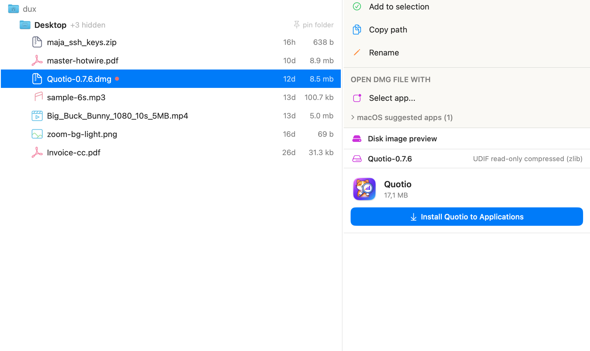

# FileExplorer

Native macOS Finder replacement built with Swift and SwiftUI. Fast, keyboard-driven, with rich file previews and iPhone file management.

[Demo page](https://dux.github.io/file_explorer_swift/web-demo/)

## Install

```
curl -fsSL https://raw.githubusercontent.com/dux/file_explorer_swift/main/install.sh?v=5b41e0b | bash
```




## Features

### File browsing
- Three-pane layout: sidebar, file browser, actions/preview
- Tree view with ancestor path breadcrumbs and indented children
- Flat folders mode: optional inline rendering instead of ancestor tree
- Sort by name or modified date (auto-selects per folder: Downloads/Desktop default to modified)
- Show/hide hidden files toggle
- Relative timestamps ("3 minutes", "2 hours & 15 min", "5 days")
- Compact file sizes (kb, mb, gb)
- Drag-and-drop files into folders
- Breadcrumb path navigation with clickable segments
- Type a letter to jump to first matching file
- Back/forward navigation history
- Open with path argument from command line or `open -a`

### Sidebar
- Home, Desktop, Downloads, Applications quick access
- Local ~/Applications toggle on Applications row
- Pinned folders with custom emoji icons (drag to reorder)
- Mounted volumes with capacity display and eject buttons
- iPhone device detection (auto-appears when connected via USB)
- Color tag filters with file counts
- Drop folders onto sidebar to pin them

### File operations
- Rename (Enter key or right-pane action)
- Duplicate files
- Move to trash (Cmd+Delete)
- Create new folder (with custom name dialog) / new text file
- Add to zip (using ditto)
- Copy file path to clipboard (with ~ shorthand)
- Multi-file selection with paste/move/trash batch operations
- Drag-and-drop copy between folders
- Extract archives (zip, tar, tgz, gz, bz2, xz, rar, 7z) into unique folder
- Context menus on file rows (open, duplicate, zip, trash, enable app) — also accessible via keyboard (`.` or Ctrl+M)

### Preview pane
- **Images**: jpg, jpeg, png, gif, bmp, webp, heic, heif, tiff, tif, svg, avif, ico
- **Text/Code**: syntax highlighted for 50+ languages (Swift, Python, JS, TS, Rust, Go, C, C++, Ruby, Java, Kotlin, Scala, etc.)
- **JSON**: collapsible tree with syntax coloring
- **Markdown**: rendered HTML preview
- **Fez**: live web component preview with source/preview toggle
- **Makefile**: syntax highlighted
- **PDF**: native preview with page navigation
- **Audio**: mp3, m4a, wav, aac, flac, ogg, wma, aiff, aif, alac, opus with waveform player and trim (ffmpeg)
- **Video**: mp4, mov, m4v, avi, mkv, webm, wmv, flv, ogv, 3gp with player and trim (ffmpeg)
- **Archives**: zip, tar, tgz, gz, bz2, xz, rar, 7z with file listing and extraction
- **DMG/ISO**: disk image and sparseimage/sparsebundle contents with mount support
- **EPUB**: ebook preview with chapter navigation
- **Comics**: cbz, cbr with page-by-page reader
- **Office documents**: metadata viewer for docx, xlsx, pptx, doc, xls, ppt (author, title, page count, etc.)
- **Folder gallery**: auto-detects image folders and shows thumbnail grid
- **Movie folders**: detects movie folders/files by title+year, fetches info from OMDB or scrapes IMDB directly (poster, ratings, cast, plot). Manual IMDB URL lookup when auto-detect fails.
- Auto-detects text files by content analysis when extension is unknown

### Image tools
- EXIF/metadata viewer (camera, GPS, aperture, ISO, lens, etc.)
- Resize and crop
- Format conversion (png, jpg, webp, heic, tiff, bmp, gif, avif)

### Git integration
- Auto-detects git repositories by traversing parent directories
- Shows "GitHub/GitLab/Bitbucket/Codeberg/SourceHut" link in actions pane
- Supports SSH, HTTPS, and ssh:// remote URL formats

### NPM package detection
- Auto-detects npm packages by finding package.json in parent directories
- Shows "NPM package home" link in actions pane
- Uses `homepage` field from package.json when defined, falls back to npmjs.com
- Skips private packages with no homepage

### Open-with system
- Per-file-type preferred app list (reorderable, with default marker)
- App selector with search across all installed apps
- macOS suggested apps section (expandable)
- Recently used apps tracking
- One-click open with any preferred app
- Drag files onto app buttons to open with that app

### App management
- Uninstall .app bundles with associated data cleanup (caches, preferences, app support, containers)
- Enable unsigned/quarantined apps (removes quarantine, cleans resource forks, re-signs)

### iPhone file management (via libimobiledevice USB)
- Browse iPhone app sandboxes (Documents, Library, etc.)
- Upload files from Mac to iPhone
- Download files from iPhone to Mac
- Delete files on iPhone
- Create folders on iPhone
- Multi-file selection with batch download/delete

### Search
- Fast recursive search using `fd`
- Real-time results with 200ms debounce
- Respects show/hide hidden files setting
- Navigate to result's parent folder on click

### Keyboard navigation
- Arrow keys: navigate files (up/down), enter/exit folders (left/right)
- Cmd+Down/Up: enter folder / go to parent (Finder-like)
- Tab: cycle focus between sidebar, file list, and right pane
- Enter: rename selected file
- Space: toggle file selection
- Cmd+Delete: move to trash
- Cmd+A / Ctrl+A: select all files
- Cmd+F: search
- Cmd+O: open with preferred app
- Ctrl+C: toggle file in selection
- Cmd+T: toggle tree / flat view
- Ctrl+R: refresh folder contents
- `.` or Ctrl+M: open context menu for selected file (navigate with Up/Down, Enter to activate, Escape to dismiss)
- Backspace: navigate back in history
- Escape: cancel search / dismiss context menu / exit color tag view
- Home/End: jump to first/last file
- Type any letter: jump to first file starting with that letter
- Right pane keyboard navigation with up/down/enter

### Color tags
- 7 colors: red, orange, yellow, green, blue, purple, gray
- Assign multiple tags per file
- Browse all files by tag color from sidebar (with keyboard navigation)
- Tags stored in config, persist across sessions

### Folder customization
- Pin any folder to sidebar (via breadcrumb bar or drag-and-drop)
- Drag-and-drop to reorder pinned folders
- Assign emoji icons to pinned folders or any folder via actions pane
- Emoji picker with search and category tabs
- Custom folder icons show in sidebar, file tree, and breadcrumbs
- Project folders auto-detected (shows code icon if README.md exists)

### Settings (Cmd+,)
- General: font size, hide previews, flat folders mode, default folder handler, config location
- Default folder handler: set as default folder opener via `duti` (replaces Finder)
- API Keys: OMDB API key for movie info

### Custom file icons
- Catppuccin-themed SVG icons for 100+ file types
- Covers programming languages, config files, media, documents, and more
- Falls back to macOS system icons for unrecognized types

### Other
- Toast notifications for operations (copy, move, trash, errors)
- Resizable panes with drag dividers (sidebar, right pane, preview split)
- Persisted window position, size, and layout (preview split, pane widths)
- Folder size caching for performance
- Config stored in `~/.config/dux-file-explorer/`
- Auto-migrates from old config paths

## vs Finder

| Feature | Finder | FileExplorer |
|---|---|---|
| Tree view with ancestors | No | Yes |
| Keyboard-driven navigation | Limited | Full (arrows, tab cycling, letter jump, context menu, right pane) |
| Color tags per file | Yes (system tags) | Yes (custom, multi-tag) |
| File preview | Quick Look (Space) | Inline preview pane, always visible |
| Code syntax highlighting | No | Yes, 50+ languages |
| JSON tree viewer | No | Yes, collapsible |
| Archive contents browsing | No (auto-extract) | Yes, browse without extracting |
| Audio/video trim | No | Yes (via ffmpeg) |
| EPUB/comic reader | No | Yes |
| Movie info lookup | No | Yes (OMDB + IMDB scraping) |
| Image resize/crop/convert | No | Yes |
| EXIF viewer | Limited (Get Info) | Full metadata viewer |
| Office document metadata | Limited (Get Info) | Author, title, pages, revision, etc. |
| iPhone file management | Via Finder sidebar (limited) | Full sandbox browsing via USB |
| App uninstaller | Drag to trash | Finds and removes all app data |
| Enable unsigned apps | Terminal commands | One-click quarantine removal + re-sign |
| Git repo links | No | Auto-detects repo, links to GitHub/GitLab/etc. |
| NPM package links | No | Auto-detects package.json, links to npm/homepage |
| Custom folder emoji icons | No | Yes |
| Open-with per file type | Yes (right-click) | One-click from actions pane |
| Default folder handler | N/A (is Finder) | Yes, via duti |
| Fast search | Spotlight (indexed) | fd-based recursive search |
| Multi-file batch operations | Yes | Yes with visual selection bar |
| Pinned folders | Sidebar favorites | Yes with custom emoji + drag reorder |

## Requirements

- macOS 13+
- Optional: `libimobiledevice` (iPhone file management), `fd` (search), `ffmpeg` (audio/video trimming), `duti` (default folder handler)

## Build

```
make          # build, install to /Applications, and run
make build    # build and install only
make run      # run the installed app
make clean    # remove build artifacts
make lint     # run SwiftLint
make test     # run tests
make watch    # auto-rebuild on file changes
make demo     # start web server for demo page
make help     # show all targets
```

## Config

Settings stored in `~/.config/dux-file-explorer/`.
